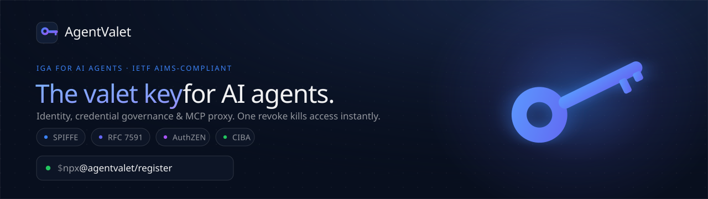

<!-- ./agentvalet-readme-header.svg : replace with the promo architecture banner image -->
<p align="center">
  
</p>

<p align="center">
  <a href="https://modelcontextprotocol.io"></a>
  
  
  
  
  
</p>

# AgentValet

Identity and credential governance broker for AI agents and MCP servers. It gives every agent its own cryptographic identity, scoped and short-lived credentials per platform, human approval gates on the actions that matter, and an immutable audit log of everything it did.

**Open core.** This repo holds the open-source MIT-licensed client surface: the MCP server, the CLI, the Claude Desktop bundle, and the runtime adapters. The managed proxy runs the credential vault, the policy engine, and the audit store. A self-host reference for the proxy is on the roadmap.

<!-- TODO: add the awesome-mcp-servers listing link once the PR is merged: https://github.com/punkpeye/awesome-mcp-servers/pull/{{PR_NUMBER}} -->
Live at [agentvalet.ai](https://agentvalet.ai).

## Quickstart

```bash
npx @agentvalet/register
```

That generates an RS256 keypair for your agent, registers it, and wires up the config. The private key never leaves your machine. From then on your agent signs a short-lived JWT per request and calls platforms through the AgentValet proxy. Approve the agent in the dashboard, grant it scopes, and you are running.

## The problem: credential inheritance

Credential inheritance is what happens when an AI agent runs on your credentials instead of its own. The moment a token lands in `.mcp.json` or an environment variable, every agent in that project inherits the full reach of that token. It can do anything you can do, on every platform the token touches, and nothing records which agent did what.

| House key agent (today's default) | Valet key agent (AgentValet) |
|-----------------------------------|------------------------------|
| Holds your real token | Holds a short-lived signed token, never your credential |
| Full scope on every platform the token reaches | Scoped to exactly the actions you granted |
| A leaked config leaks everything | A leaked config leaks nothing reusable |
| No record of which agent did what | Every call attributed to one agent identity |
| Revoking means rotating the token everywhere | One revoke, instant, no rotation |

## How it works

```
Agent (holds its RS256 private key)
    |
    |  signs a 60-second JWT per request
    v
+-------------------------------------------+
|              AgentValet proxy             |
|  1. verify JWT signature                  |
|  2. check scope grant (deny by default)   |
|  3. scan request for leaked secrets       |
|  4. AuthZEN policy evaluation             |
|  5. human approval gate, if required      |
|  6. inject real credential in memory      |---> SaaS platform
|  7. append-only audit log entry           |
+-------------------------------------------+
    |
    v
Dashboard: approve registrations, manage scopes, review the audit log, monitor usage
MCP server: exposes AgentValet as tools for Claude and any MCP-compatible agent
```

Credentials use envelope encryption: a unique AES-256 data key per credential, wrapped by a master key held in a Key Vault HSM, decrypted in memory only at call time and never written to a log.

## Features

- Per-agent RS256 cryptographic identity, SPIFFE-format URIs, 60-second signed JWTs
- Deny-by-default scopes, granular per-agent-per-platform-per-action grants
- Human-in-the-loop approval for destructive or financial scopes, one-click magic-link
- Immutable, append-only audit log, filterable and exportable
- Three-strike circuit breaker that auto-suspends a misbehaving agent
- Native MCP server plus a one-command CLI
- Self-hostable: PostgreSQL-backed, runs in your own infrastructure
- Standards-aligned: SPIFFE, RFC 7591 Dynamic Client Registration, AuthZEN 1.0, IETF AIMS

## How AgentValet compares

Honest framing. These are strong tools that reached agent governance from an adjacent starting point.

| | AgentValet | Aembit | Akeyless | Infisical Agent Vault |
|---|---|---|---|---|
| Starting point | Agent-first identity and governance | Workload identity | Secrets management | Secrets vault |
| Where it sits | Identity-layer credential broker | Edge proxy near workloads | Gateway in your network | Network-layer forwarding proxy |
| Onboarding | Self-serve, under 5 minutes | Enterprise sales-led | Enterprise sales-led | Self-host or cloud |
| Open source | Open core, MIT* | No | No | Core open source |
| Standout strength | AIMS-aligned, approval gates, audit, cheap entry | Attestation-based identity | Distributed fragments cryptography | Network-level interception |

\* The client surface (MCP server, CLI, bundle, adapters) is MIT in this repo. The proxy is a managed service today, with a self-host reference on the roadmap.

If you already run Aembit or Akeyless at enterprise scale, AgentValet is not trying to replace your identity provider. If you are a developer or small team shipping agents this week, AgentValet is built for you.

## Roadmap and known limitations

Building in public, so the rough edges are listed here rather than discovered.

**Known limitations today**
- The SSE stream for approval status can close prematurely on long waits. Reconnect logic is planned.
- CLI rate limiting is rudimentary.
- There is no clear or delete UI yet for expired pending registrations.

**On the roadmap**
- Self-host reference for the proxy (the open client surface already runs anywhere)
- SIEM export for the audit log (Enterprise)
- Multi-region self-hosting guides
- Custom integrations UI (today these are requested through the roadmap system)
- PII handling Phase 2: detection at the broker layer

## What is open and what is managed

Open source in this repo, MIT licensed: the MCP server, the `@agentvalet/register` CLI, the Claude Desktop bundle, and the runtime adapters. These run anywhere and talk to the proxy over a documented HTTP API.

Managed service today: the proxy that holds the credential vault, runs the policy engine, and writes the audit log. A self-host reference for the proxy is on the roadmap. See `CONTRIBUTING.md` for local development of the open packages.

## Security

Found a vulnerability? Please report it privately, see `SECURITY.md`. Do not open a public issue for security reports.

## License

MIT. See `LICENSE`.
